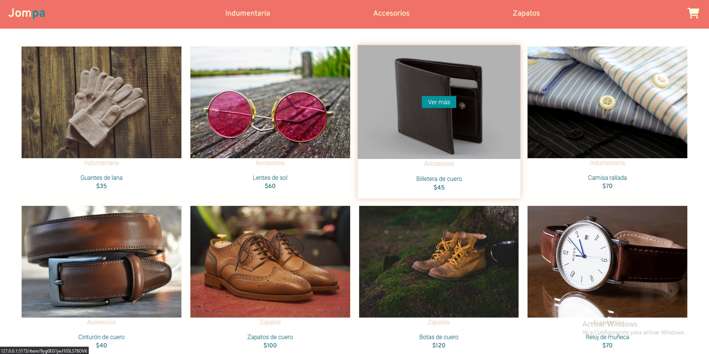
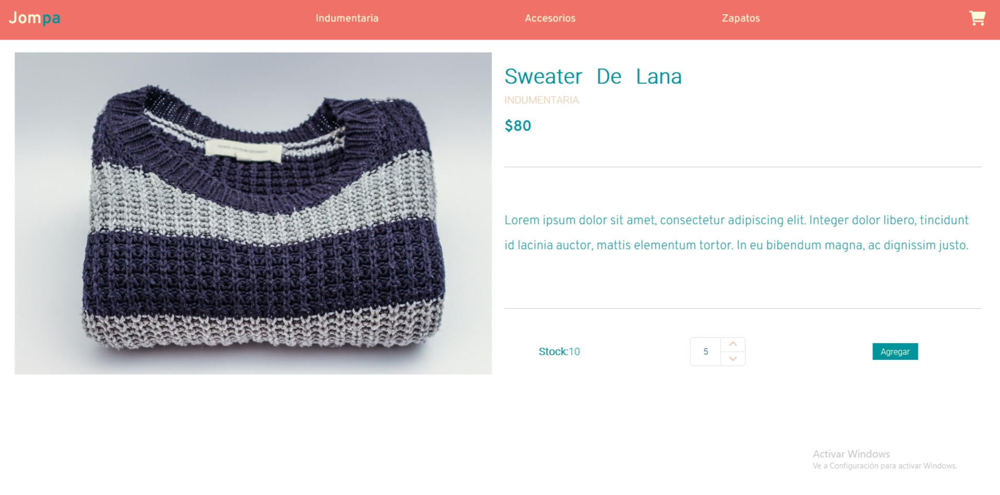
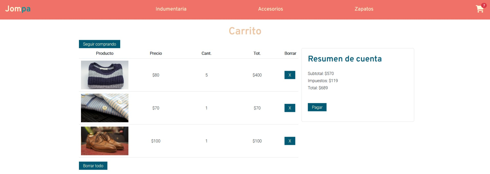

# React ecommerce

Project made for coderhouse React course. It's a an ecommerce app with a short-form catalog of products.

I use `npx install vite@latest` as a template.

## Demo
#### I invite you to check the demo [:arrow_right: here :arrow_left:](https://jompa-spacommerce.netlify.app/)

## Screenshots :iphone:
#### landing page

#### description

#### cart

## Tech Stack :man_technologist:
### Techs
#### client
- [React](https://reactjs.org/)

#### database
- [Firebase/Firestore](https://firebase.google.com/)

#### CSS framework
- [Bootstrap](https://getbootstrap.com/docs/5.2/getting-started/introduction/)

### Aditionals
- [context](https://reactjs.org/docs/context.html) to handle the cart state.
- [sweetalert2](https://sweetalert2.github.io/) to display loaders.
- [react-router-dom](https://www.npmjs.com/package/react-router-dom) to improve the users navigation.

## GIF :computer_mouse:

## Scripts :knot:

-  Use `npm run dev` to run the server

-  Use `npm run format` to format with Prettier

-  Use `npm run lint` to lint with ESLint
## Contact me :email:
#### manufer6503@gmail.com
#### https://www.linkedin.com/in/manuelffernandez/
